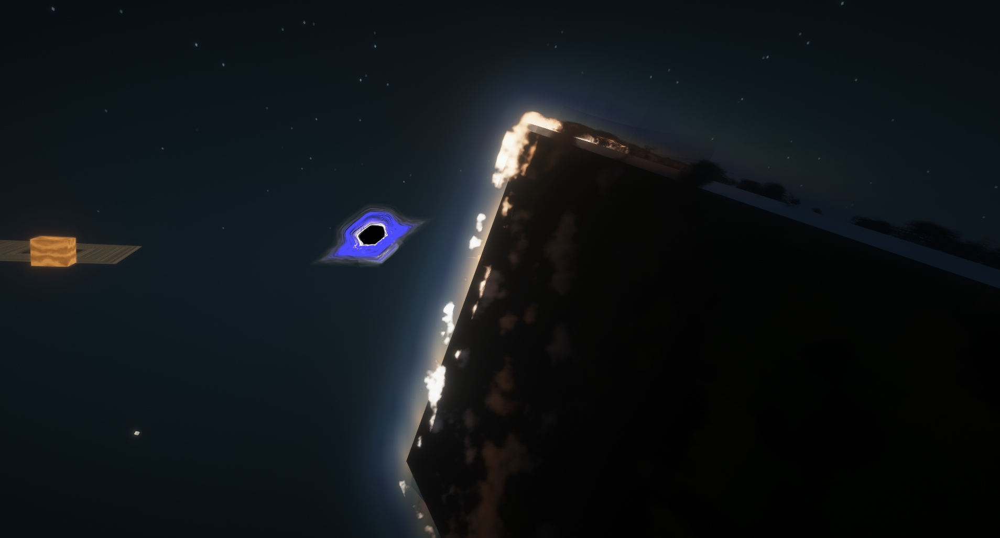
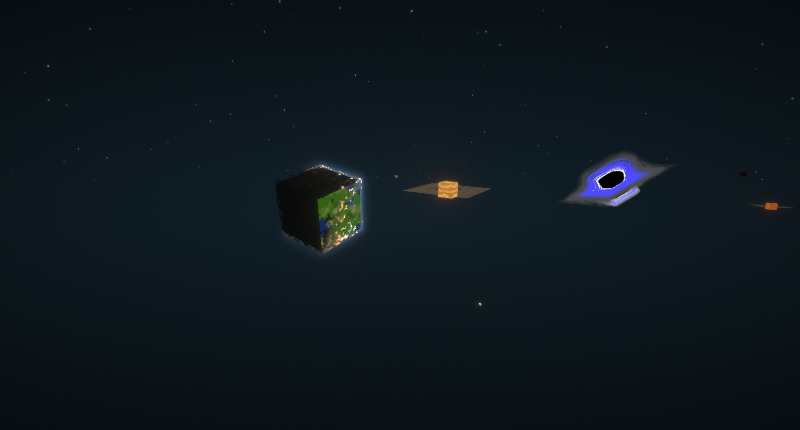
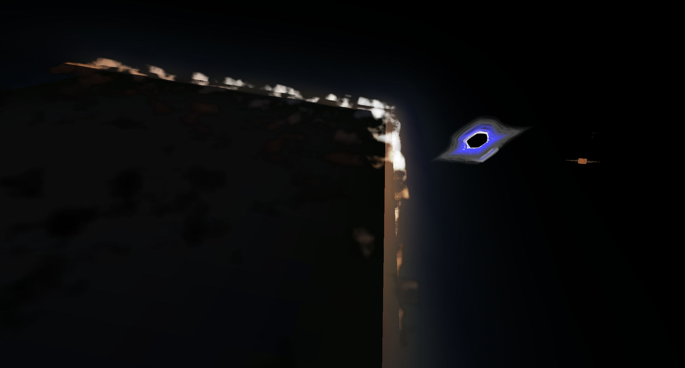
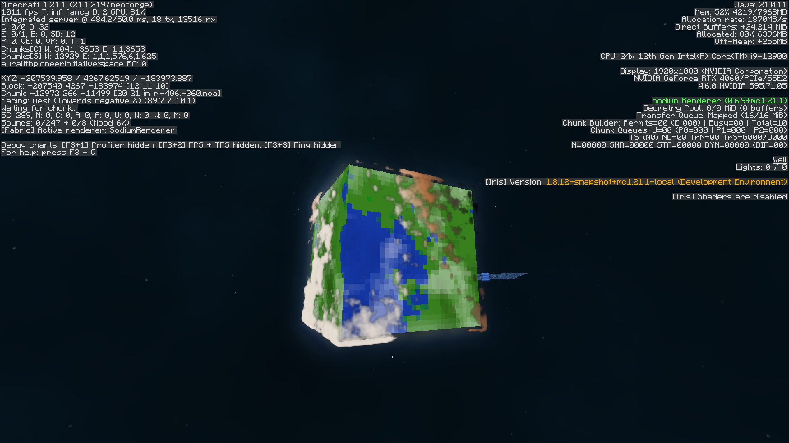

#

#
#

#### The cute lil space mod who reinvent the wheel :3

  
  
  

I wanted a space like **Star Citizen** or **Elite Dangerous** a huge,
actually explorable space. Not a handful of flat dimensions you teleport between
with a rocket, but real planets sitting in real orbits that you fly out to,
approach, and land on, with the world changing under you the whole way.
The other half of it  the part that got me started  is that space mods and
shaderpacks don't get along. You install a shaderpack and the pretty sky mod
either vanishes, renders through walls, or turns into flat grey squares. That
annoyed me enough to build around it: Auralith's VFX shaders opt *out* of
shaderpack replacement rather than fighting it, so everything stays intact with Iris running.

### What's different?

Most space mods are **content** mods: dimensions, ores, rockets, machines,
oxygen. Galacticraft, Ad Astra and friends do that well, and the space between
the dimensions is mostly a loading screen because that isn't the point.

For Auralith the space *between* is the point:

- **Planets are places, not destinations** they orbit on real elliptical paths with axial tilt and spin, defined per-planet in JSON. What you see in the sky is where the planet actually is right now.
- **Seamless transitions** fly up and the dimension swap happens *underneath* you. No loading screen, no cutscene: the planet you were standing on fades into the sky behind you, already tilted and spinning correctly.
- **Volumetric clouds** raymarched through a baked 3D noise volume, with self-shadowing, powder effect and Mie scattering. Not a rotating texture on a slightly larger sphere/cube.
- **Physical atmospheres** Rayleigh + Mie scattering with ozone absorption and multi-scattering, so sunsets happen because of the maths, not a gradient.
- **Shadows that mean something** rings shadow the planet, the planet shadows the rings, and clouds shadow the surface below them.
- **Shaderpack compatible** the whole point. It looks like this *with* Iris on.

**Status: WIP.** Right now it's mostly rendering,
Galacticraft-style gameplay (oxygen, machines, progression) is planned, but the rendering is the miserable part so it went first. 
Things will break, JSON formats will change, and some of the above is prettier in the screenshots than in your actual game. :3

### Performance 
Volumetric rendering is expensive. This isn't: 
